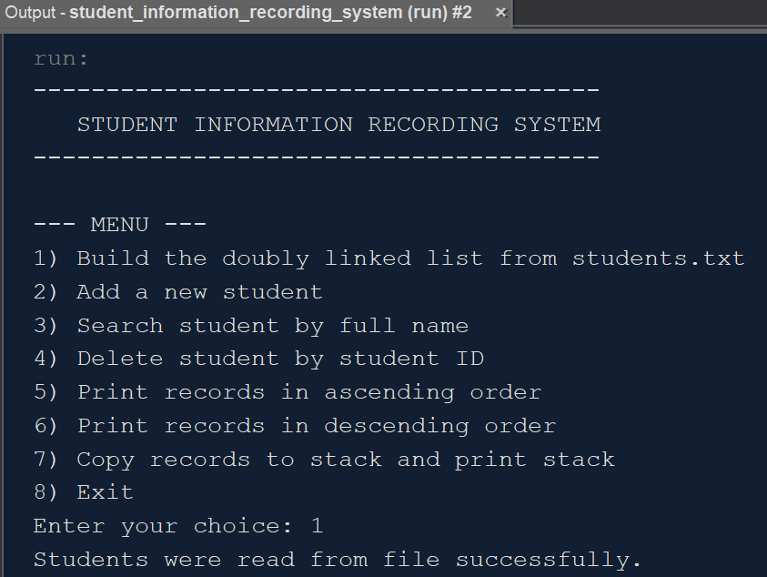
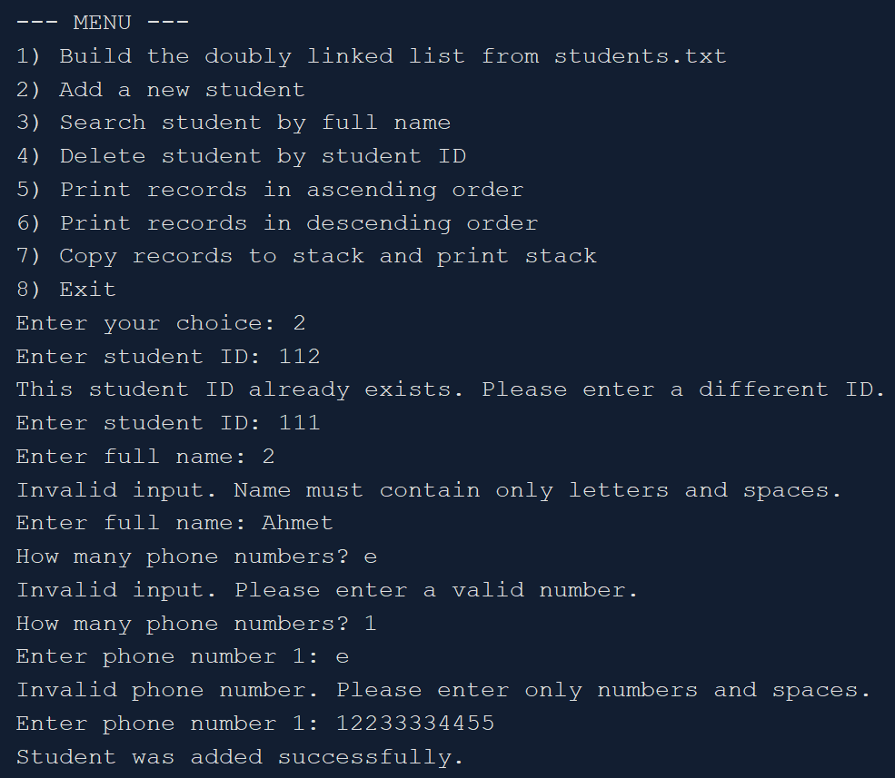
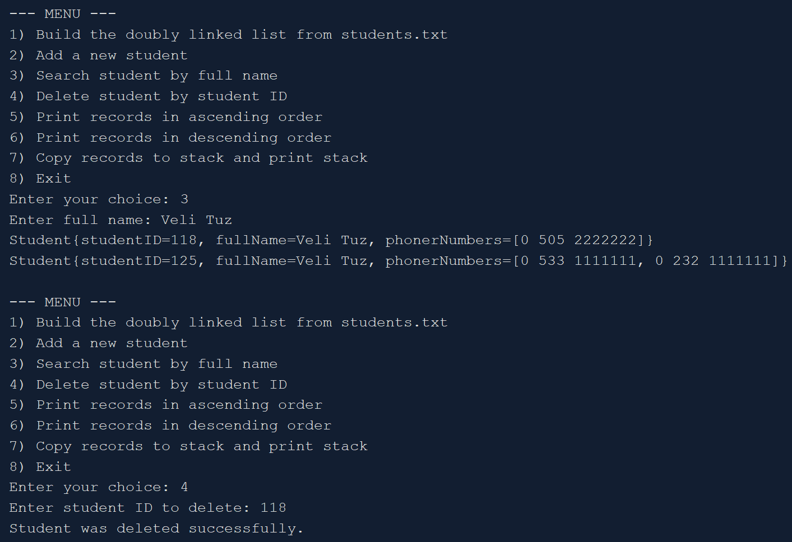
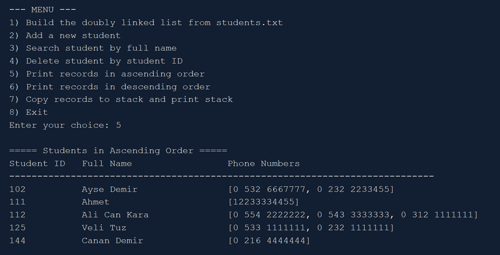
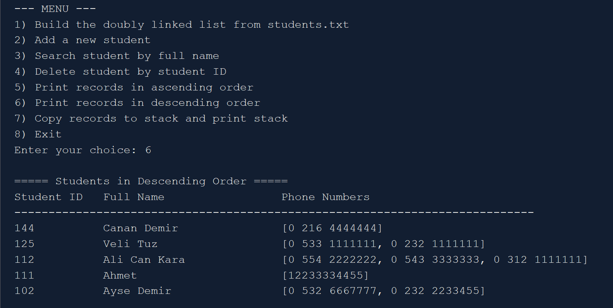
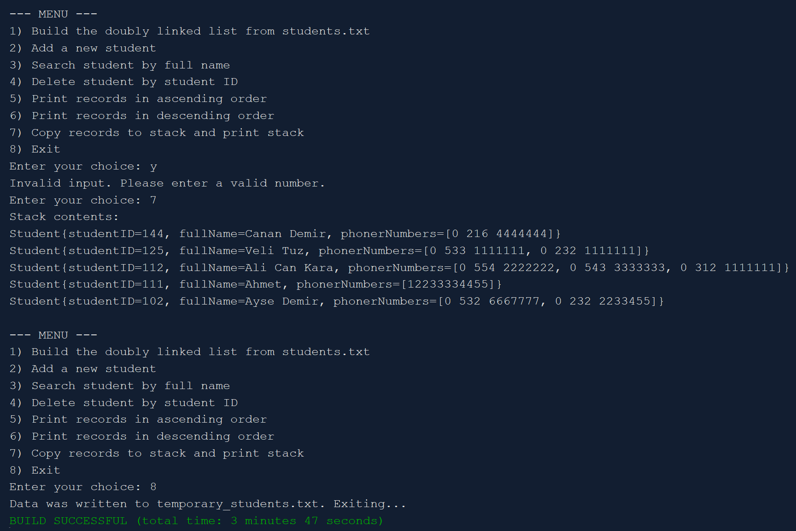

# Student Information Recording System

This project is a Java-based console application that manages student records using a **Doubly Linked List** data structure. It allows dynamic insertion, deletion, searching, and file operations while maintaining the list in sorted order by student ID.

## Features

- Build a sorted doubly linked list from a file (`students.txt`)
- Insert new students while keeping the list sorted
- Prevent duplicate student IDs
- Search students by full name (supports multiple matches)
- Delete a student by ID
- Display records in:
  - Ascending order
  - Descending order
- Copy all students into a custom **Stack** and print them
- Save the final list into a temporary file before exiting
- Input validation for:
  - Numeric fields
  - Names (letters only)
  - Phone numbers

## Data Structure

- **Doubly Linked List**
  - Maintains sorted order during insertion
- **Stack (Custom Implementation)**
  - Used to store and display student records

## File Format

Example `students.txt`:

- First value: Student ID (unique)
- Second value: Full Name
- Remaining values: Phone numbers

## Technologies Used

- Java
- Object-Oriented Programming (OOP)
- Custom Data Structures (Linked List & Stack)

## How to Run

1. Clone the repository:
   ```bash
   git clone https://github.com/tugrahek/student_information_recording_system.git

## Sample Outputs







